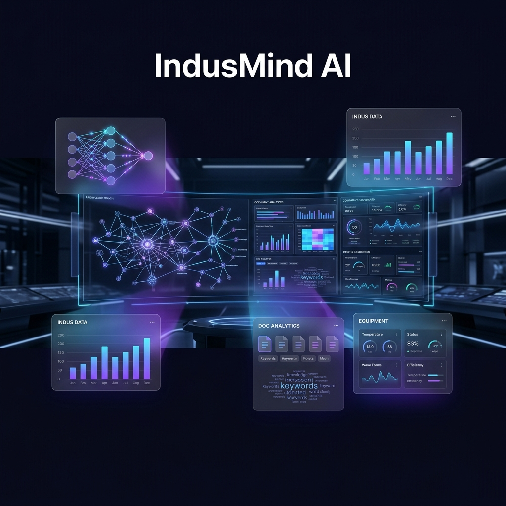
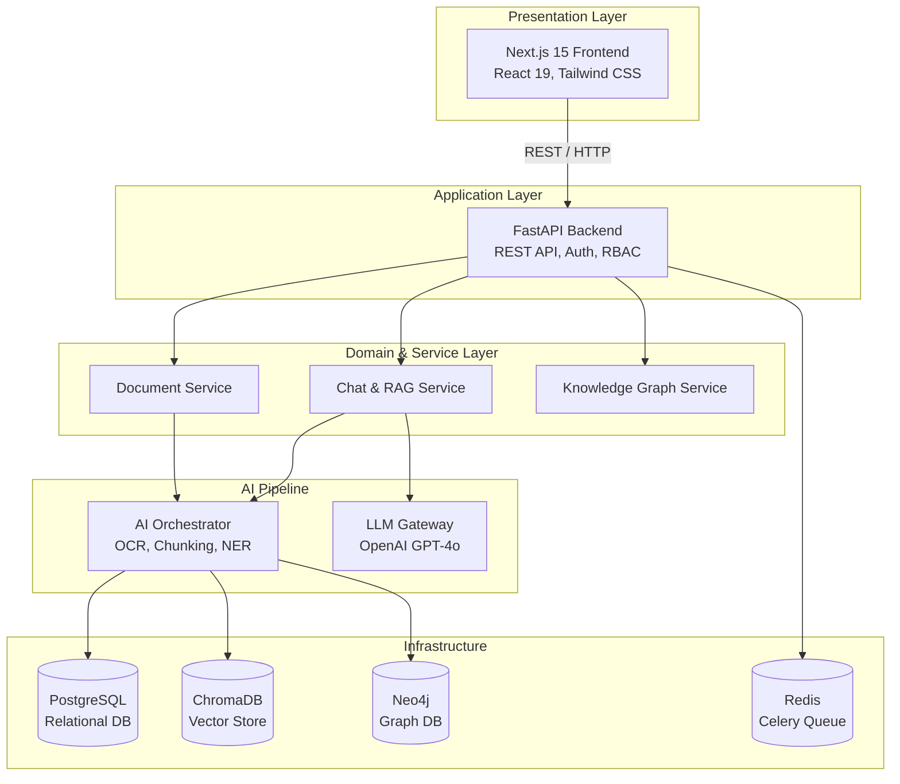
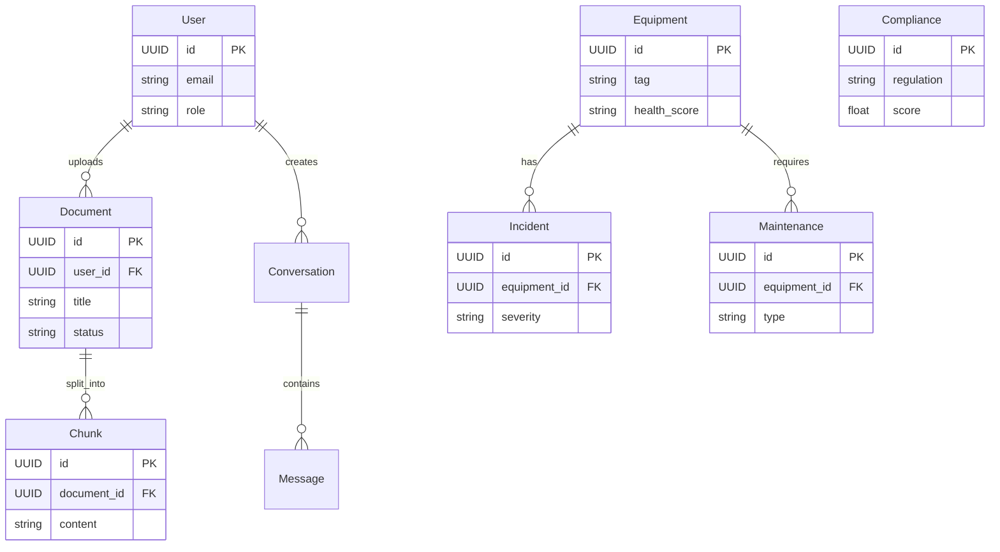
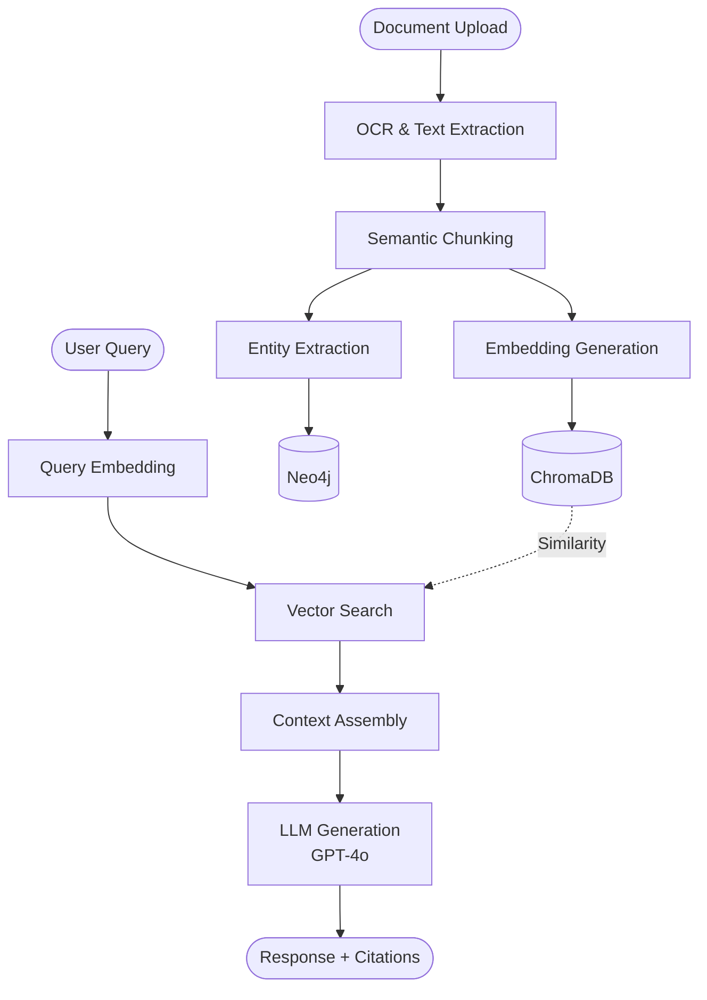

<div align="center">



<br/>
<br/>

# 🧠 IndusMind AI

### The AI Brain for Industrial Operations

**Transform thousands of PDFs, SOPs, inspection reports, and maintenance logs into structured, searchable intelligence.**

*IndusMind AI is an enterprise-grade platform that bridges the gap between disconnected industrial data and actionable operational intelligence. Using Retrieval-Augmented Generation (RAG) and Knowledge Graphs, it empowers engineers to ask questions, predict failures, and ensure compliance seamlessly.*

<br/>

[](LICENSE)
[](https://github.com/Harshitkumar63/IndusMind-AI/actions)
[](CONTRIBUTING.md)
[](https://github.com/Harshitkumar63/IndusMind-AI/stargazers)
[](https://github.com/Harshitkumar63/IndusMind-AI/commits/main)

<br/>

[](https://nextjs.org/)
[](https://fastapi.tiangolo.com/)
[](https://python.org/)
[](https://typescriptlang.org/)
[](https://postgresql.org/)
[](https://docker.com/)
[](https://openai.com/)
[](https://neo4j.com/)

<br/>

[Features](#-features) · [Architecture](#-architecture) · [Quick Start](#-quick-start) · [Documentation](#-documentation) · [Contributing](#-contributing)

</div>

---

## 📋 Table of Contents

- [Why IndusMind AI?](#-why-indusmind-ai)
- [Features](#-features)
- [Architecture](#-architecture)
- [Tech Stack](#-tech-stack)
- [Project Structure](#-project-structure)
- [Quick Start](#-quick-start)
- [Screenshots](#-screenshots)
- [API Reference](#-api-reference)
- [AI Pipeline](#-ai-pipeline)
- [Knowledge Graph](#-knowledge-graph)
- [Documentation](#-documentation)
- [Roadmap](#-roadmap)
- [Contributing](#-contributing)
- [License](#-license)
- [Acknowledgements](#-acknowledgements)

---

## 🎯 Why IndusMind AI?

### The Problem

Industrial organizations generate **thousands of documents** — maintenance manuals, inspection reports, SOPs, compliance records, incident logs. This critical knowledge is **trapped in PDFs and spreadsheets**.

| Pain Point | Impact |
|-----------|--------|
| Engineers spend **40% of time** searching for information | Lost productivity |
| Critical safety knowledge is buried in documents | Compliance risk |
| Equipment failure patterns are invisible | Unplanned downtime |
| Audit preparation requires weeks of manual review | Regulatory penalties |

### The Solution

IndusMind AI transforms this chaos into an **intelligent, queryable knowledge base** using:

- 🤖 **RAG (Retrieval-Augmented Generation)** — Precise Q&A with source citations
- 🕸️ **Knowledge Graphs** — Map relationships between equipment, people, regulations
- 🔮 **Predictive Maintenance** — Intelligence from historical failure data
- 🛡️ **Compliance Analysis** — Score against OSHA, ISO, and API standards

### Who Is This For?

| Role | Use Case |
|------|----------|
| **Plant Engineers** | Equipment troubleshooting, technical queries |
| **Maintenance Engineers** | Predictive maintenance, work order intelligence |
| **Safety Officers** | Incident analysis, safety compliance checks |
| **Quality Engineers** | Audit preparation, gap analysis |
| **Operations Managers** | Dashboard oversight, KPI monitoring |

---

## 🎮 Live Demo

Experience IndusMind AI instantly without complex setup. The frontend runs in **Demo Mode** by default with pre-loaded industrial data.

[](#-quick-start)

> **No API Keys Required:** In Demo Mode, the platform uses intelligent heuristics to simulate RAG responses and Knowledge Graph interactions based on a realistic industrial dataset (Pump P-101 maintenance, OSHA compliance).

---

## ✨ Features

<table>
<tr>
<td width="50%">

### 🔍 AI-Powered RAG Chat
- Natural language Q&A over your entire document corpus
- Source citations with relevance scores
- Conversation history and context threading
- Suggested follow-up questions
- Confidence scoring

</td>
<td width="50%">

### 📄 Document Intelligence
- Drag-and-drop upload (PDF, DOCX, XLSX, CSV, Images)
- OCR for scanned documents (Tesseract/PyMuPDF)
- Automatic text extraction and semantic chunking
- Embedding generation and vector storage (ChromaDB)
- Grid/list view with category filtering

</td>
</tr>
<tr>
<td>

### 🕸️ Knowledge Graph
- Automatic entity extraction (Equipment, People, SOPs, Regulations)
- Relationship inference via co-occurrence analysis
- Interactive visualization (React Flow with custom nodes)
- Neo4j-backed graph storage
- Entity type filtering and search

</td>
<td>

### 🔧 Maintenance Intelligence
- Equipment health scoring and risk assessment
- Failure prediction with probability estimates
- Work order tracking (preventive, corrective, predictive)
- AI-generated maintenance recommendations
- Cost tracking and trend analysis

</td>
</tr>
<tr>
<td>

### 🛡️ Compliance Analysis
- Multi-standard compliance scoring (OSHA, ISO, API, ASME)
- Violation tracking with severity and assignment
- AI-powered audit summaries
- Trend analysis over time
- Gap identification with recommendations

</td>
<td>

### 📊 Analytics Dashboard
- 6 KPI summary cards with trend indicators
- Incident severity distribution (stacked area chart)
- Equipment health comparison (horizontal bar chart)
- Compliance trend (line chart)
- Document category distribution (donut chart)
- Maintenance cost tracking (area chart)

</td>
</tr>
</table>

---

## 🏗️ Architecture



> 📐 Detailed architecture documentation: [`docs/ARCHITECTURE.md`](docs/ARCHITECTURE.md)
> 🗄️ Database ER diagrams & schema: [`docs/DATABASE.md`](docs/DATABASE.md)

### Database Entity-Relationship Diagram



---

## 🛠️ Tech Stack

### Frontend
| Technology | Purpose |
|-----------|---------| 
| **Next.js 15** | React framework with App Router |
| **TypeScript** | Type-safe development |
| **Tailwind CSS** | Utility-first styling |
| **Framer Motion** | Animations & transitions |
| **Recharts** | Data visualization |
| **React Flow** | Knowledge graph visualization |
| **Radix UI** | Accessible component primitives |
| **Zustand** | State management |

### Backend
| Technology | Purpose |
|-----------|---------| 
| **FastAPI** | ASGI web framework |
| **Python 3.11** | Core language |
| **SQLAlchemy 2.0** | Async ORM |
| **Pydantic v2** | Validation & settings |
| **Celery** | Async task queue |
| **Structlog** | Structured logging |

### AI / ML
| Technology | Purpose |
|-----------|---------| 
| **OpenAI GPT-4o** | LLM for RAG responses |
| **Sentence Transformers** | Local embedding generation |
| **ChromaDB** | Vector similarity search |
| **Neo4j** | Knowledge graph storage |
| **PyMuPDF + Tesseract** | Document OCR & extraction |

### Infrastructure
| Technology | Purpose |
|-----------|---------| 
| **PostgreSQL 16** | Primary relational database |
| **Redis 7** | Caching & task broker |
| **Docker Compose** | Container orchestration |

---

## 📁 Project Structure

```
IndusMind-AI/
│
├── frontend/                    # Next.js 15 Application
│   └── src/
│       ├── app/
│       │   ├── page.tsx         # Landing page
│       │   ├── globals.css      # Design system
│       │   └── (platform)/      # Platform route group
│       │       ├── layout.tsx   # Sidebar + Top bar
│       │       ├── dashboard/   # Analytics dashboard
│       │       ├── chat/        # AI RAG chat
│       │       ├── documents/   # Document management
│       │       ├── knowledge-graph/  # Knowledge graph
│       │       ├── maintenance/ # Maintenance intelligence
│       │       ├── compliance/  # Compliance analysis
│       │       ├── analytics/   # Detailed analytics
│       │       └── settings/    # Platform settings
│       └── lib/                 # API client & utilities
│
├── backend/                     # FastAPI Application
│   └── app/
│       ├── main.py              # Application factory
│       ├── core/                # Config, security, logging
│       ├── domain/models/       # SQLAlchemy ORM models
│       ├── api/v1/endpoints/    # 9 API modules
│       ├── services/            # Business logic layer
│       ├── infrastructure/      # DB, cache, vector, graph, LLM
│       ├── ai/                  # OCR, embeddings, RAG, NER
│       └── workers/             # Celery async tasks
│
├── docs/                        # 📖 Documentation
│   ├── ARCHITECTURE.md          # System architecture
│   ├── DATABASE.md              # Database design
│   ├── API.md                   # API reference
│   ├── AI_PIPELINE.md           # AI pipeline details
│   ├── DEPLOYMENT.md            # Deployment guide
│   ├── SYSTEM_DESIGN.md         # System design
│   ├── DEVELOPER_GUIDE.md       # Developer guide
│   └── KNOWLEDGE_GRAPH.md       # Knowledge graph
│
├── docker/                      # 🐳 Docker
│   ├── docker-compose.yml       # Full stack orchestration
│   ├── backend.Dockerfile
│   └── frontend.Dockerfile
│
├── database/                    # Database initialization
│   └── init.sql
│
├── assets/                      # 🎨 Branding
│   ├── banner.png               # Hero banner
│   ├── logo.png                 # Logo icon
│   └── branding/README.md       # Brand guidelines
│
├── scripts/                     # 🔧 Development scripts
│   ├── setup.sh                 # Project setup
│   └── seed.sh                  # Database seeding
│
├── tests/                       # 🧪 Test suites
│   ├── backend/                 # Backend pytest tests
│   └── frontend/                # Frontend tests
│
├── .github/                     # GitHub configuration
│   ├── workflows/ci.yml         # CI pipeline
│   ├── workflows/docker.yml     # Docker build validation
│   ├── ISSUE_TEMPLATE/          # Issue templates
│   ├── PULL_REQUEST_TEMPLATE.md
│   └── dependabot.yml           # Dependency updates
│
├── CONTRIBUTING.md              # Contribution guidelines
├── CODE_OF_CONDUCT.md           # Contributor covenant
├── SECURITY.md                  # Security policy
├── CHANGELOG.md                 # Release history
├── ROADMAP.md                   # Project roadmap
├── LICENSE                      # MIT License
├── Makefile                     # Development commands
└── README.md                    # You are here
```

---

## 🚀 Quick Start

### Option 1: Frontend Only (Fastest)

```bash
# Clone the repository
git clone https://github.com/Harshitkumar63/IndusMind-AI.git
cd IndusMind-AI

# Install and run
cd frontend
npm install
npm run dev
```

Open **[http://localhost:3000](http://localhost:3000)** — the platform runs with demo data out of the box. No API keys needed.

### Option 2: Full Stack (Docker)

```bash
cd docker
docker compose up -d
```

| Service | URL |
|---------|-----|
| Frontend | [http://localhost:3000](http://localhost:3000) |
| Backend API | [http://localhost:8000](http://localhost:8000) |
| API Docs (Swagger) | [http://localhost:8000/docs](http://localhost:8000/docs) |
| Neo4j Browser | [http://localhost:7474](http://localhost:7474) |

### Option 3: Backend Only

```bash
cd backend
python -m venv .venv
source .venv/bin/activate    # Linux/Mac
# .venv\Scripts\activate     # Windows

pip install -r requirements.txt
cp .env.example .env
uvicorn app.main:app --reload --port 8000
```

> 📖 Full setup guide: [`docs/DEVELOPER_GUIDE.md`](docs/DEVELOPER_GUIDE.md)

---

## 🖼️ Screenshots

> **Note**: Screenshots will be added after the UI is fully polished. The platform features:

| Page | Description |
|------|-------------|
| **Landing Page** | Premium dark-mode landing with animated hero, feature cards, stats bar |
| **Dashboard** | 6 KPI cards, incident trends, equipment health, compliance score, document categories |
| **AI Chat** | ChatGPT-style interface with citations, confidence scores, suggested questions |
| **Knowledge Graph** | Interactive React Flow visualization with custom entity-typed nodes |
| **Maintenance** | Equipment health table, risk assessment, AI recommendations |
| **Compliance** | Score gauge, standard-by-standard progress, violation tracker |
| **Analytics** | Detailed charts for incidents, equipment, documents, and costs |

<!-- Screenshots will be added here:


-->

---

## 📡 API Reference

Base URL: `http://localhost:8000/api/v1`

| Method | Endpoint | Description |
|--------|----------|-------------|
| `GET` | `/health` | Health check |
| `POST` | `/auth/login` | User authentication |
| `GET` | `/documents` | List documents |
| `POST` | `/documents/upload` | Upload document |
| `POST` | `/chat/conversations` | Create conversation |
| `POST` | `/chat/conversations/{id}/messages` | Send message (RAG) |
| `GET` | `/knowledge-graph` | Get full graph |
| `GET` | `/knowledge-graph/search?q=` | Search graph nodes |
| `GET` | `/equipment` | List equipment |
| `GET` | `/maintenance/intelligence` | AI maintenance insights |
| `GET` | `/compliance/score` | Overall compliance score |
| `GET` | `/analytics/dashboard` | Dashboard aggregates |
| `GET` | `/search/semantic?q=` | Semantic search |

> 📖 Full API documentation: [`docs/API.md`](docs/API.md) | Interactive: [localhost:8000/docs](http://localhost:8000/docs)

---

## 🤖 AI Pipeline



| Stage | Technology | Details |
|-------|-----------|---------|
| OCR/Extract | PyMuPDF, Tesseract | Multi-format: PDF, DOCX, XLSX, Images |
| Chunking | Custom | Sentence-boundary, 512 tokens, 50 overlap |
| Embeddings | Sentence Transformers | `all-MiniLM-L6-v2` (384 dimensions) |
| Vector Store | ChromaDB | Cosine similarity, metadata filtering |
| NER | Regex-based | Equipment IDs, SOPs, regulations, incidents |
| Knowledge Graph | Neo4j | Co-occurrence relationship inference |
| RAG | OpenAI GPT-4o | Context-augmented generation with citations |

> 📖 Full pipeline documentation: [`docs/AI_PIPELINE.md`](docs/AI_PIPELINE.md)

---

## 🕸️ Knowledge Graph

IndusMind AI automatically constructs a knowledge graph from your documents:

- **Equipment** ↔ **People** (maintained_by)
- **Equipment** ↔ **Regulations** (governed_by)
- **Equipment** ↔ **Locations** (located_in)
- **Equipment** ↔ **SOPs** (referenced_in)
- **People** ↔ **Incidents** (involved_in)

> 📖 Full knowledge graph documentation: [`docs/KNOWLEDGE_GRAPH.md`](docs/KNOWLEDGE_GRAPH.md)

---

## 📖 Documentation

| Document | Description |
|----------|-------------|
| [`ARCHITECTURE.md`](docs/ARCHITECTURE.md) | System architecture and design patterns |
| [`DATABASE.md`](docs/DATABASE.md) | Database schema, ER diagrams, indexing |
| [`API.md`](docs/API.md) | Complete REST API reference |
| [`AI_PIPELINE.md`](docs/AI_PIPELINE.md) | OCR → RAG pipeline details |
| [`DEPLOYMENT.md`](docs/DEPLOYMENT.md) | Docker, cloud, and production deployment |
| [`SYSTEM_DESIGN.md`](docs/SYSTEM_DESIGN.md) | High-level design and scalability |
| [`DEVELOPER_GUIDE.md`](docs/DEVELOPER_GUIDE.md) | Development setup and conventions |
| [`KNOWLEDGE_GRAPH.md`](docs/KNOWLEDGE_GRAPH.md) | Graph schema and query patterns |

---

## 🗺️ Roadmap

| Phase | Focus | Status |
|-------|-------|--------|
| **v1.0** | Core platform — RAG, Knowledge Graph, Compliance, Maintenance | ✅ Released |
| **v1.1** | Streaming chat, advanced RAG, batch upload, export reports | 🚧 Next |
| **v1.2** | User management, RBAC, audit logging, comprehensive tests | 📋 Planned |
| **v2.0** | Predictive ML, anomaly detection, P&ID viewer, plugins | 🔮 Future |

> 📖 Full roadmap: [`ROADMAP.md`](ROADMAP.md)

---

## 🤝 Contributing

We welcome contributions from everyone! Whether it's:

- 🐛 **Bug Reports** — Found an issue? [Report it](https://github.com/Harshitkumar63/IndusMind-AI/issues/new?template=bug_report.yml)
- 💡 **Feature Requests** — Have an idea? [Suggest it](https://github.com/Harshitkumar63/IndusMind-AI/issues/new?template=feature_request.yml)
- 📝 **Documentation** — Improvements always welcome
- 🔧 **Code** — Fix bugs or implement features

Please read our [**Contributing Guide**](CONTRIBUTING.md) and [**Code of Conduct**](CODE_OF_CONDUCT.md) before getting started.

---

## 📄 License

This project is licensed under the **MIT License** — see the [LICENSE](LICENSE) file for details.

---

## 🙏 Acknowledgements

- [OpenAI](https://openai.com/) — GPT-4o for intelligent responses
- [FastAPI](https://fastapi.tiangolo.com/) — High-performance Python web framework
- [Next.js](https://nextjs.org/) — React framework for production
- [ChromaDB](https://www.trychroma.com/) — Open-source vector database
- [Neo4j](https://neo4j.com/) — Graph database platform
- [Sentence Transformers](https://www.sbert.net/) — State-of-the-art embeddings
- [Framer Motion](https://www.framer.com/motion/) — Production-ready animations
- [Recharts](https://recharts.org/) — React charting library
- [Lucide](https://lucide.dev/) — Beautiful & consistent icons

---

<div align="center">

**⭐ Star this repository if you find it useful!**

Built with ❤️ for the **AI Hackathon 2025**

*Transforming Industrial Knowledge into Actionable Intelligence*

<br/>

[](https://github.com/Harshitkumar63/IndusMind-AI/stargazers)
[](https://github.com/Harshitkumar63/IndusMind-AI/network)

</div>
