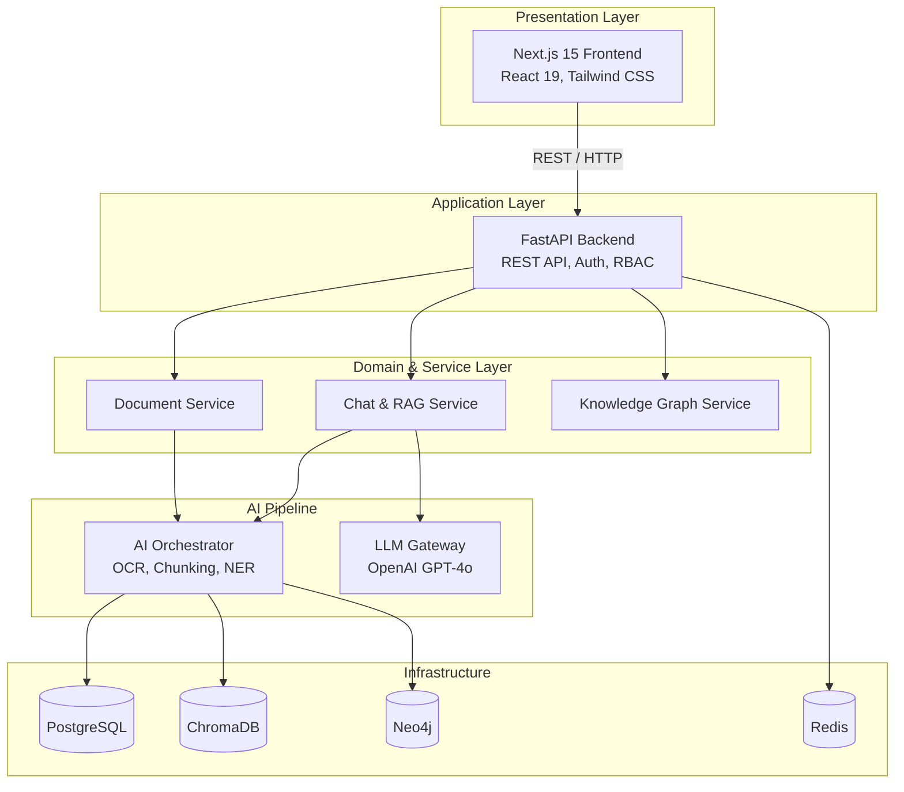
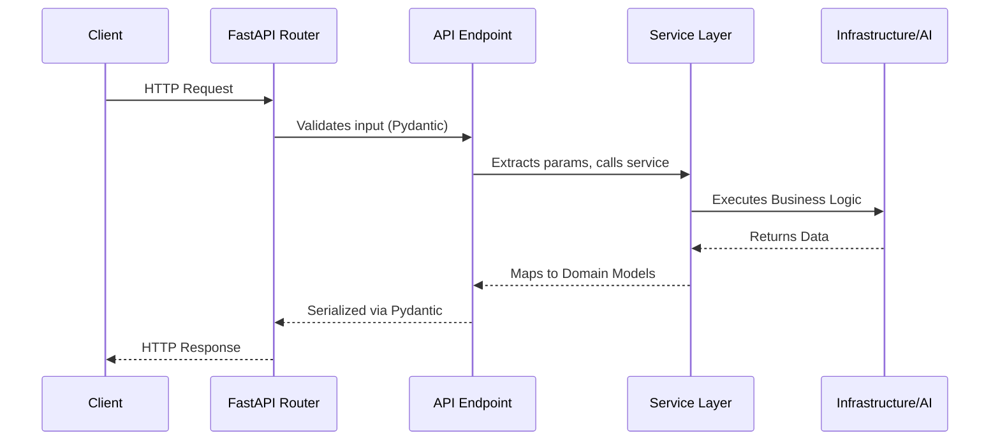
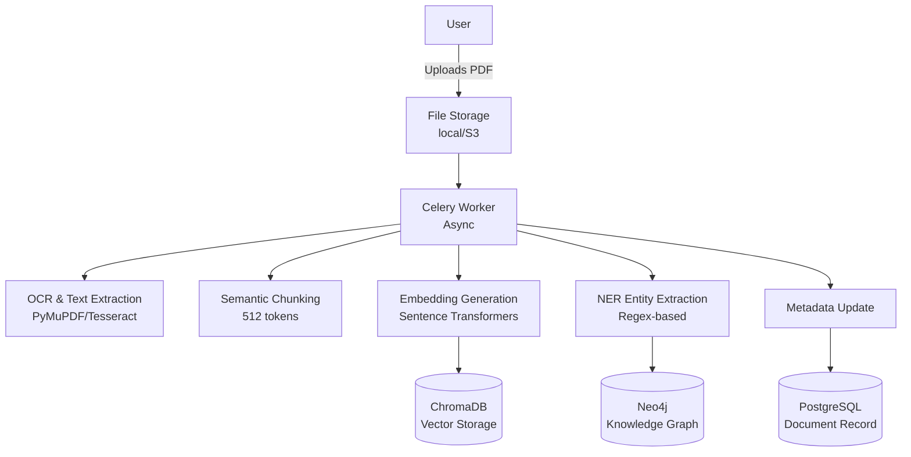
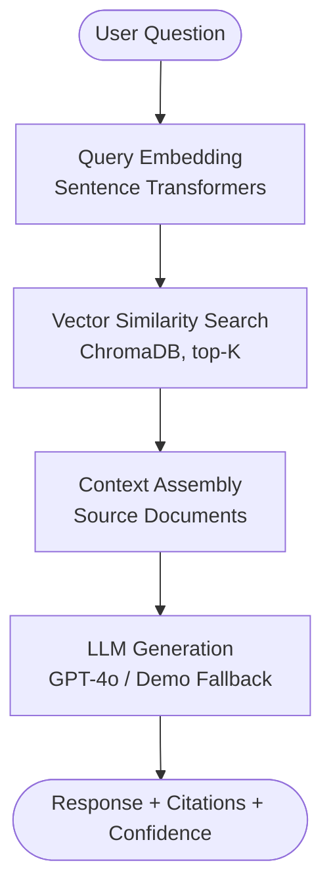
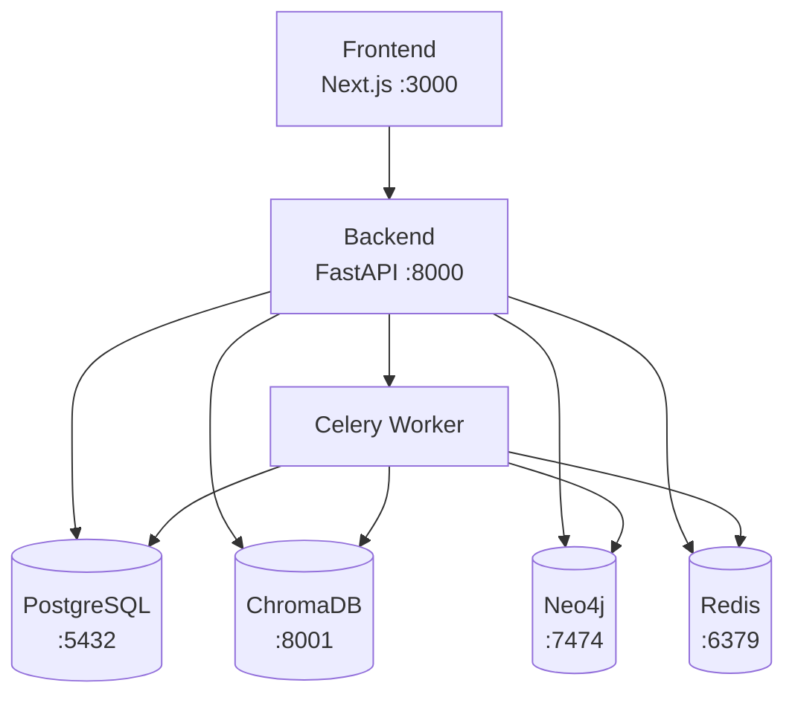

# Architecture

> System architecture for IndusMind AI — Industrial Knowledge Intelligence Platform

---

## Overview

IndusMind AI follows a **Clean Architecture** pattern with clear separation of concerns across four distinct layers. Each layer has a well-defined responsibility and communicates only with its adjacent layers.



---

## Design Principles

| Principle | Implementation |
|-----------|---------------|
| **Single Responsibility** | Each service class handles one domain (documents, chat, maintenance) |
| **Open/Closed** | Infrastructure adapters are swappable (e.g., local storage → S3) |
| **Dependency Inversion** | Services depend on abstractions, not concrete database implementations |
| **Repository Pattern** | Infrastructure layer wraps all external system access |
| **Gateway Pattern** | `LLMGateway` provides a unified interface to OpenAI with demo fallback |
| **Service Layer** | All business logic lives in `services/`, keeping API endpoints thin |
| **Feature Modules** | Frontend pages are self-contained feature modules |

---

## Backend Architecture

### Layer Breakdown

```
backend/app/
├── api/                  # API Layer — Route definitions only
│   └── v1/
│       ├── router.py     # Route aggregator
│       ├── deps.py       # Dependency injection
│       └── endpoints/    # 9 endpoint modules
│
├── services/             # Service Layer — Business logic
│   ├── document_service.py
│   ├── chat_service.py
│   ├── knowledge_graph_service.py
│   └── analytics_service.py
│
├── domain/               # Domain Layer — Models & enums
│   ├── models/           # SQLAlchemy ORM models
│   └── enums.py          # Domain enumerations
│
├── ai/                   # AI Pipeline — ML & NLP
│   ├── ocr/              # Text extraction
│   ├── embeddings/       # Vector generation
│   ├── rag/              # Retrieval-Augmented Generation
│   └── ner/              # Named Entity Recognition
│
├── infrastructure/       # Infrastructure — External systems
│   ├── database.py       # PostgreSQL (async SQLAlchemy)
│   ├── vector_store.py   # ChromaDB
│   ├── graph_db.py       # Neo4j
│   ├── redis.py          # Redis cache
│   ├── storage.py        # File storage (local/S3)
│   └── llm.py            # LLM Gateway (OpenAI)
│
├── core/                 # Core — Cross-cutting concerns
│   ├── config.py         # Pydantic settings
│   ├── security.py       # JWT + RBAC
│   ├── logging.py        # Structlog
│   └── exceptions.py     # Domain exceptions
│
└── workers/              # Workers — Async processing
    └── tasks.py          # Celery tasks
```

### Request Flow



---

## Frontend Architecture

### Next.js App Router Structure

```
frontend/src/
├── app/
│   ├── page.tsx                      # Landing page (marketing)
│   ├── layout.tsx                    # Root layout (fonts, metadata)
│   ├── globals.css                   # Design system tokens
│   └── (platform)/                   # Route group (shared layout)
│       ├── layout.tsx                # Sidebar + Top bar
│       ├── dashboard/page.tsx        # Analytics dashboard
│       ├── chat/page.tsx             # AI RAG chat
│       ├── documents/page.tsx        # Document management
│       ├── knowledge-graph/page.tsx  # Knowledge graph viz
│       ├── maintenance/page.tsx      # Maintenance intelligence
│       ├── compliance/page.tsx       # Compliance analysis
│       ├── analytics/page.tsx        # Detailed analytics
│       └── settings/page.tsx         # Platform settings
└── lib/
    ├── api.ts                        # Axios API client
    └── utils.ts                      # Utility functions
```

### Design System

The frontend uses a CSS custom properties-based design system defined in `globals.css`:

- **Theme**: Dark mode with glassmorphism effects
- **Colors**: Indigo-to-violet gradient palette
- **Typography**: System font stack with semibold headings
- **Components**: Glass cards, badges, gradient buttons, animated transitions
- **Animations**: Framer Motion for page transitions, scroll-reveal, hover effects

---

## Data Flow

### Document Ingestion Pipeline



### RAG Query Pipeline



---

## Security Architecture

| Layer | Mechanism |
|-------|-----------|
| **Authentication** | JWT tokens with configurable expiry |
| **Authorization** | Role-based access control (RBAC) |
| **Input Validation** | Pydantic v2 for all API inputs |
| **SQL Injection** | SQLAlchemy ORM with parameterized queries |
| **File Upload** | Type validation, size limits, path sanitization |
| **CORS** | Configurable allowed origins |
| **Secrets** | Environment variables via Pydantic Settings |
| **Demo Mode** | Bypass auth for evaluation (disabled in production) |

---

## Infrastructure Topology



---

## Related Documentation

- [Database Design](DATABASE.md)
- [API Reference](API.md)
- [AI Pipeline](AI_PIPELINE.md)
- [System Design](SYSTEM_DESIGN.md)
- [Deployment Guide](DEPLOYMENT.md)
- [Developer Guide](DEVELOPER_GUIDE.md)
