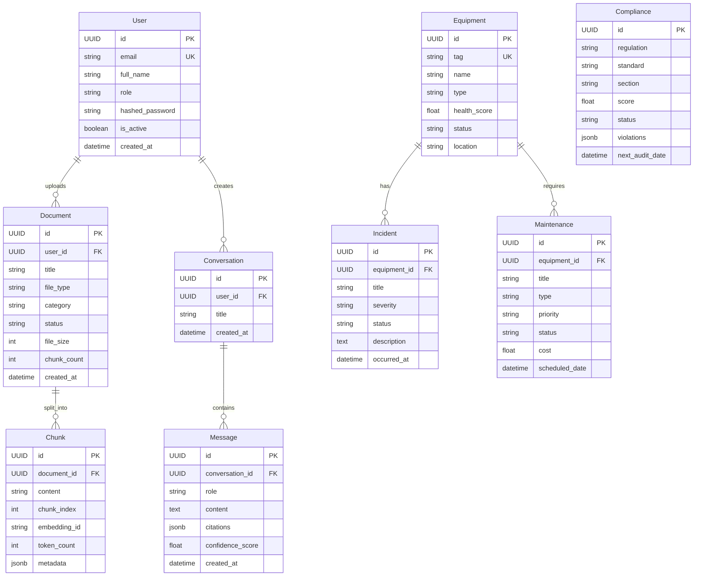

# Database Design

> Data model and database architecture for IndusMind AI

---

## Overview

IndusMind AI uses a **polyglot persistence** strategy with three specialized databases:

| Database | Purpose | Technology |
|----------|---------|------------|
| **Relational** | User data, documents, equipment, compliance | PostgreSQL 16 |
| **Vector** | Document embeddings for similarity search | ChromaDB |
| **Graph** | Knowledge graph (entities + relationships) | Neo4j 5 |

---

## Entity-Relationship Diagram



---

## Enumerations

### UserRole
```
admin | engineer | viewer | auditor
```

### DocumentStatus
```
pending | processing | completed | failed
```

### DocumentCategory
```
manual | sop | inspection | maintenance | regulation | audit | report | other
```

### EquipmentStatus
```
operational | degraded | offline | maintenance | decommissioned
```

### EquipmentType
```
pump | compressor | boiler | exchanger | tank | valve | motor | turbine | vessel
```

### IncidentSeverity
```
critical | major | minor | informational
```

### MaintenanceType
```
preventive | corrective | predictive | breakdown
```

### MaintenancePriority
```
critical | high | medium | low
```

### ComplianceStandard
```
osha_psm | iso_45001 | iso_14001 | api_510 | api_570 | asme
```

---

## Vector Store (ChromaDB)

### Collection: `indusmind_documents`

| Field | Type | Description |
|-------|------|-------------|
| `id` | string | Unique chunk identifier |
| `embedding` | float[384] | Sentence Transformer embedding vector |
| `document` | string | Original chunk text content |
| `metadata` | object | Document metadata (see below) |

#### Metadata Schema
```json
{
  "document_id": "uuid",
  "document_title": "string",
  "chunk_index": "integer",
  "page_number": "integer",
  "category": "string",
  "file_type": "string"
}
```

---

## Graph Database (Neo4j)

### Node Types

| Label | Properties | Description |
|-------|-----------|-------------|
| `Equipment` | tag, name, type, location, health_score | Plant equipment |
| `Person` | name, role, department | People referenced in documents |
| `SOP` | code, title, version | Standard Operating Procedures |
| `Regulation` | standard, section, title | Regulatory standards |
| `Location` | name, area, building | Physical locations |
| `Incident` | id, title, severity, date | Safety incidents |

### Relationship Types

| Relationship | From → To | Description |
|-------------|-----------|-------------|
| `MAINTAINED_BY` | Equipment → Person | Maintenance assignments |
| `GOVERNED_BY` | Equipment → Regulation | Applicable regulations |
| `LOCATED_IN` | Equipment → Location | Physical location |
| `REFERENCED_IN` | Equipment → SOP | Mentions in procedures |
| `INVOLVED_IN` | Person → Incident | Incident participation |
| `RELATED_TO` | Equipment → Equipment | Co-occurrence relationship |

---

## Indexing Strategy

### PostgreSQL Indexes

| Table | Column(s) | Type | Rationale |
|-------|-----------|------|-----------|
| `users` | `email` | UNIQUE B-tree | Login lookups |
| `documents` | `uploaded_by` | B-tree | User's documents |
| `documents` | `category` | B-tree | Category filtering |
| `documents` | `status` | B-tree | Processing queue |
| `chunks` | `document_id` | B-tree | Document chunks |
| `equipment` | `tag` | UNIQUE B-tree | Equipment lookups |
| `incidents` | `equipment_id` | B-tree | Equipment incidents |
| `maintenance` | `equipment_id` | B-tree | Equipment maintenance |
| `conversations` | `user_id` | B-tree | User conversations |

---

## Related Documentation

- [Architecture](ARCHITECTURE.md)
- [API Reference](API.md)
- [Deployment Guide](DEPLOYMENT.md)
